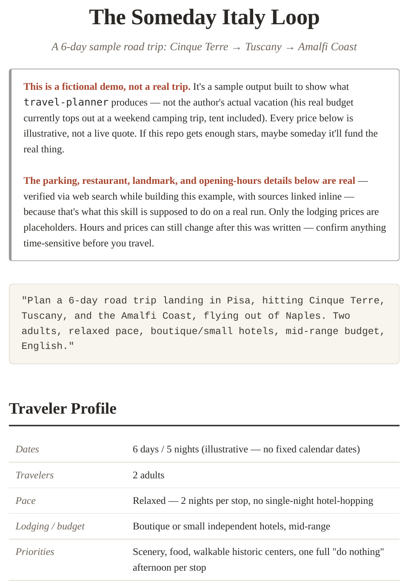

# Travel Planner

<p align="center">
  
</p>

<p align="center">
  
  
  
</p>

## One-line promise

Turn one travel prompt into a print-friendly itinerary with live lodging options and honest fallback labels — no invented prices.

> **Note:** This is an **early release (v0.1.0)**. The plugin is stable and tested, but subject to refinement based on community feedback. Please [report issues](https://github.com/asoshnin/travel-planner/issues) and feature requests — they directly shape the roadmap to v1.0.

---

## Why it's different

- **Live lodging search** through supported booking sites instead of inventing hotel results
- **Print-friendly HTML itinerary** with maps, photos, and daily structure — not just a chat transcript
- **Honest fallback behavior** — clearly labeled estimates when live data cannot be verified, rather than fake certainty

---

## Quick start

1. **Install** the plugin in Claude Cowork or Claude Code (see [Installing](#installing) below).
2. **Paste this prompt:**
   > Plan a 7-day road trip from Amsterdam through the Mosel and Alsace, 2 adults, relaxed pace, boutique hotels, mid-range budget, English.
3. **Answer** the short set of clarifying questions (dates, pace, budget, output language).
4. **Review** the generated HTML itinerary and lodging options.

---

## See it in action

Here's what a single prompt produces:

> "Plan a 6-day road trip landing in Pisa, hitting Cinque Terre, Tuscany, and the Amalfi Coast, flying out of Naples. Two adults, relaxed pace, boutique/small hotels, mid-range budget, English."

**Sample output** (rendered from the prompt above):



The narrative, the lodging comparisons, and the day-by-day structure all come out of that one prompt — no manual formatting, no separate hotel-tab-juggling.

**Click through to one full stop** (Tuscany, Day 3–4 — photo, narrative, and lodging comparison together):

<p align="center">
  <a href="https://htmlpreview.github.io/?https://github.com/asoshnin/travel-planner/blob/main/examples/dream-vacation-example.html">
    
  </a>
</p>

<p align="center"><i>Click the image to open the live rendered page (opens in a new tab, same file that ships in this repo).</i></p>

A real run searches mainstream booking sites (Booking.com, Expedia, Airbnb, etc.) live and returns three actual, dated listings per stop in this same format — never a bare `[PENDING]` placeholder.

> **Note on this demo:** This particular trip is fictional, not the author's real vacation (his actual budget currently tops out at a weekend camping trip, tent included). Every price shown is illustrative, not a live quote. If this repo gets enough stars, maybe someday it'll fund the real thing. Full example is in [`examples/`](examples/).

---

## Who this is for

- Road-trip travelers who want a polished, dated itinerary they can actually use
- Users who care about real lodging options, not generic hotel suggestions
- Claude Cowork / Claude Code users who want a shareable, print-friendly final artifact instead of just chat output

---

## What's in this plugin

| Skill | What it does |
|---|---|
| `lodging-search` | Searches live booking sites (a global default, a named regional/payment preset, or your own custom list) for each overnight stop and returns up to 3 ranked options (by guest rating and availability) with pros/cons — or an honest, labeled estimate if live search isn't possible. Never returns a bare "pending" placeholder. |
| `travel-itinerary-builder` | Interactively confirms your traveler profile (dates, pace, budget, output language, and more), then builds a narrative-rich, print-friendly, static HTML itinerary with real lodging cards, licensed and attributed photos, and link-based maps — no API keys required. Every stop also gets a recommended departure time, a parking note, and named restaurants/landmarks with opening hours, with explicit "not verified" labels where real-time confirmation wasn't available. |

---

## Why this exists

Most AI-generated itineraries either hallucinate hotel prices or leave placeholders entirely. The `lodging-search` skill solves this by distinguishing accessibility issues from empty markets, retrying sensibly, and always returning either real data or a clearly labeled estimate — never a silent gap.

`travel-itinerary-builder` ensures that lodging data, plus the narrative you wrote, survives into the final HTML instead of being flattened into a link list. It applies the same honesty rule to travel logistics: recommended departure times (not durations), named parking options, and real opening hours or explicit "not verified" labels — never plausible guesses.

---

## Installing

### Claude Cowork (recommended — fastest path)

New to installing Claude plugins? Follow these steps exactly — every click is listed.

1. Open Cowork and go to **Customize** → **Plugins**.
2. Click **+** → **Add marketplace**.
3. You'll see two options — click **Add from a repository** (not "Browse Anthropic sources," which is only for Anthropic's own curated catalog).
4. In the **URL** field, paste this exact address:
   ```
   https://github.com/asoshnin/travel-planner
   ```
   > ⚠️ **Common mistake:** if you copy the link from your browser's address bar while looking at this repo on GitHub, it may include extra text like `/tree/main` at the end. **Remove that suffix** — the URL must end in `travel-planner`, nothing after it.
   >
   > ✅ Correct: `https://github.com/asoshnin/travel-planner`
   > ❌ Wrong: `https://github.com/asoshnin/travel-planner/tree/main`
5. Click **Sync**. If you haven't connected GitHub to Cowork before, you'll be prompted to do so now — this connects **your own** GitHub account, not the plugin author's. It's a one-time step Cowork uses to verify access and fetch the repository; since this repo is public, any GitHub account works. You are not asking anyone for permission.
6. Cowork will show the plugin found in this repository. Find **travel-planner** in that list and click **Install** next to it.

That's it — the `lodging-search` and `travel-itinerary-builder` skills are now available. Type `/travel-itinerary-builder` in a chat to confirm it worked.

*(Once this plugin is listed on [claude.com/plugins](https://claude.com/plugins/) in the future, you'll also be able to install it directly from there.)*

### Claude Code

Add the marketplace, then install by name:
```
claude plugin marketplace add https://github.com/asoshnin/travel-planner
claude plugin install travel-planner@travel-planner
```

**Alternative — local install without adding a marketplace:** clone the repo and install directly from your own machine:
```bash
git clone https://github.com/asoshnin/travel-planner
cd travel-planner
claude plugin install .
```

See the [Claude Code documentation](https://docs.claude.com) for plugin installation details.

---

## Requirements

- **Claude Cowork**, or **Claude Code** with browser-automation tooling available (`mcp__claude-in-chrome__*`, `mcp__computer-use__*`, or an equivalent live-browser tool)
  - Live lodging search requires your Claude environment to control a browser. If your setup cannot browse booking sites, see Limitations → "Live prices depend on site accessibility" for fallback behavior.
- **No API keys required** — lodging search uses your existing browser access, and maps use OpenStreetMap link-outs.

---

## Using it

Just describe your trip:

> "Plan a 10-day road trip from Amsterdam through the Alps to Lake Como and back, 2 adults, relaxed pace, self-catering apartments preferred."

The itinerary builder will ask a short set of clarifying questions (dates, budget, output language, etc.) before drafting anything, then hand off to lodging search for each overnight stop once the plan is locked. You can also invoke either skill on its own — e.g. "find me 3 hotel options in Lisbon for next weekend" will trigger `lodging-search` directly. More sample prompts (short, single-purpose ones) are in [`examples/`](examples/).

### Choosing a booking-site scope

By default, `lodging-search` uses mainstream global sites (Booking.com, Expedia, Airbnb, etc.). If you have a payment-method constraint or a regional preference, say so — for example "only search sites that work from China" — and it will offer a matching preset, or you can just name the exact sites you want it to use. See the plugin's lodging-search documentation for built-in site presets and how to add your own.

---

## Limitations

- **Live prices depend on site accessibility** — if a booking site is experiencing downtime, has an active anti-bot measure, or requires JavaScript execution beyond the plugin's browser tooling, live search will fall back to a labeled estimate.
- **Booking-site coverage varies by region** — some sites operate in only certain countries or require local payment methods. The plugin will indicate which sites are available for your destination.
- **Restaurant hours and parking details** are verified via web search where possible, but explicit "not confirmed" labels indicate where real-time verification wasn't available. Always confirm time-sensitive details before travel.
- **Static HTML output** means the itinerary doesn't auto-update if hotel prices or restaurant hours change after generation — you're responsible for spot-checking before booking.

---

## If this saved you some time

A star helps other people find it, and if you've built a useful regional or payment-method site preset, a pull request adding it to `references/site-presets.md` is genuinely useful — that's the part most likely to need knowledge neither of us has alone.

## Contributing

Issues and pull requests welcome.

## License

MIT — see [`LICENSE`](LICENSE).

---

## Developer Notes

The `commit-push.ps1` and `commit-push.bat` scripts in the repo root are **author-only convenience tools** for local development. They are excluded from distribution (.gitignore) and are not needed to use the plugin. Community members can ignore these files; they will not be included in any plugin distribution or marketplace listing.

If you're maintaining a fork and want similar workflow scripts, see these files for reference — they now use relative paths (script-directory-relative) so they'll work on any machine.
